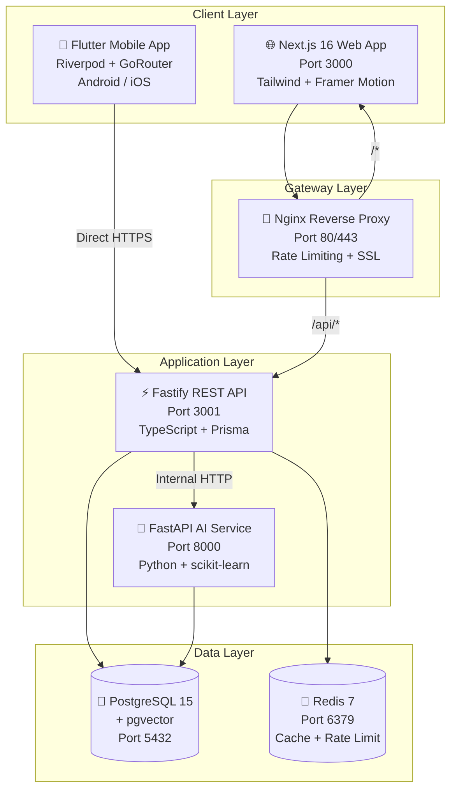
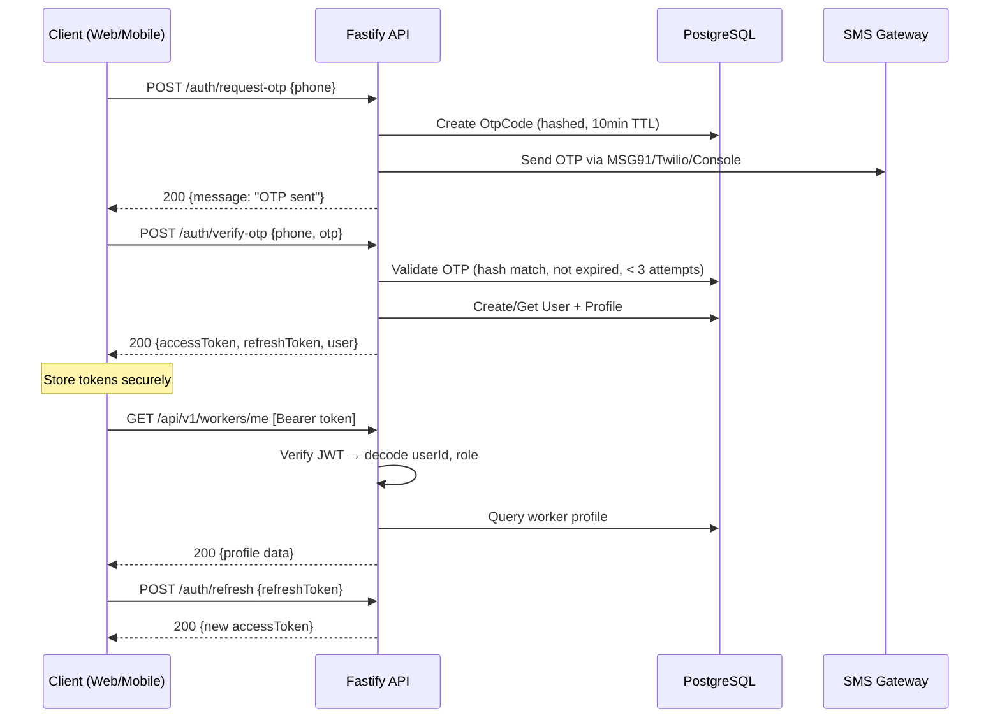
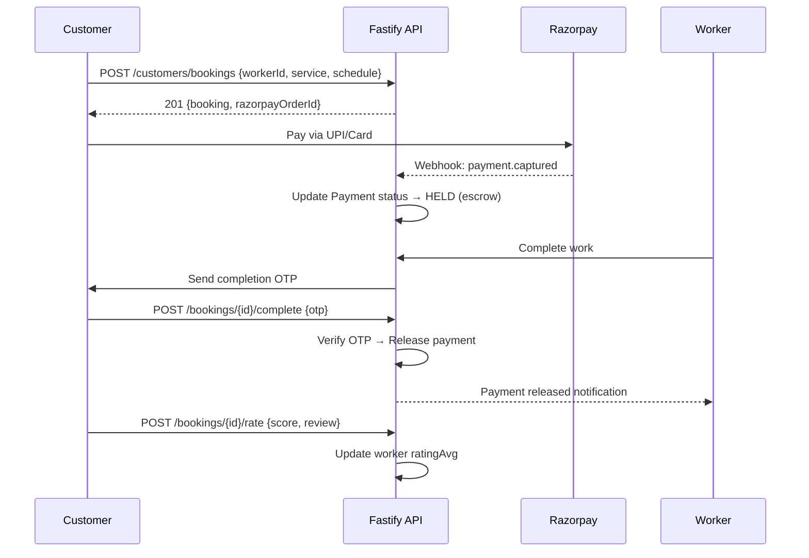

# 🏗️ Hunar — Project Architecture

## System Overview

Hunar is a **monorepo platform** with 4 deployable services + 1 mobile app, connected via REST APIs and reverse-proxied through Nginx.



---

## 📁 Monorepo Structure

```
hunar/
├── apps/
│   ├── api/                    # Fastify REST API (TypeScript)
│   │   ├── src/
│   │   │   ├── server.ts       # Entry point, plugin registration
│   │   │   ├── lib/            # prisma.ts, redis.ts
│   │   │   ├── middleware/     # authenticate.ts, authorize.ts, errorHandler.ts
│   │   │   └── modules/       # 10 feature modules
│   │   │       ├── auth/       #   auth.routes.ts, auth.service.ts
│   │   │       ├── workers/    #   worker.routes.ts, worker.service.ts
│   │   │       ├── jobs/       #   job.routes.ts, job.service.ts
│   │   │       ├── employers/  #   employer.routes.ts, employer.service.ts
│   │   │       ├── customers/  #   customer.routes.ts, customer.service.ts
│   │   │       ├── payments/   #   payment.routes.ts (Razorpay)
│   │   │       ├── ratings/    #   rating.routes.ts
│   │   │       ├── notifications/
│   │   │       ├── admin/      #   admin.routes.ts
│   │   │       └── ai/         #   ai.routes.ts (proxy to AI service)
│   │   ├── prisma/
│   │   │   ├── schema.prisma   # 15 models, 13 enums, pgvector
│   │   │   └── seed.ts         # Development seed data
│   │   ├── Dockerfile          # Multi-stage Node.js 20 build
│   │   └── package.json
│   │
│   ├── web/                    # Next.js 16 Web Frontend
│   │   ├── src/
│   │   │   ├── app/            # App Router pages
│   │   │   │   ├── page.tsx    # Landing page (27KB, full marketing)
│   │   │   │   ├── login/      # Phone + OTP auth
│   │   │   │   ├── verify-otp/ # OTP verification
│   │   │   │   ├── worker/     # Worker dashboard pages
│   │   │   │   ├── employer/   # Employer dashboard pages
│   │   │   │   └── customer/   # Customer marketplace pages
│   │   │   ├── components/     # Reusable UI components
│   │   │   └── lib/
│   │   │       ├── api.ts      # Axios client + JWT interceptor
│   │   │       ├── hooks.ts    # React Query hooks (30+ hooks)
│   │   │       └── store.ts    # Zustand auth store
│   │   ├── Dockerfile          # Multi-stage Next.js standalone
│   │   └── package.json
│   │
│   ├── ai-service/             # FastAPI AI Microservice
│   │   ├── app/
│   │   │   ├── main.py         # FastAPI entry + CORS
│   │   │   └── routers/
│   │   │       ├── recommend.py       # Job-worker matching
│   │   │       ├── extract_skills.py  # NLP skill extraction
│   │   │       ├── predict_salary.py  # Salary prediction
│   │   │       └── rank_applicants.py # Applicant ranking
│   │   ├── requirements.txt    # FastAPI, scikit-learn, spacy, xgboost
│   │   └── Dockerfile          # Multi-stage Python 3.11
│   │
│   └── mobile/                 # Flutter Mobile App
│       ├── lib/
│       │   ├── main.dart       # Entry + ProviderScope
│       │   ├── app.dart        # MaterialApp + theme
│       │   ├── core/
│       │   │   ├── api/        # Dio client + JWT interceptor
│       │   │   ├── auth/       # Riverpod auth state
│       │   │   ├── router/     # GoRouter + auth guards
│       │   │   └── theme/      # Material 3 design system
│       │   └── features/
│       │       ├── auth/       # 3 screens: role, phone, OTP
│       │       ├── worker/     # 7 screens: dashboard → settings
│       │       ├── employer/   # 6 screens: dashboard → analytics
│       │       ├── customer/   # 6 screens: dashboard → profile
│       │       └── shared/     # Bottom nav shell
│       └── pubspec.yaml
│
├── packages/
│   └── shared/                 # Shared TypeScript types/constants
│
├── infra/
│   ├── docker-compose.yml      # Development stack
│   ├── init-db.sql             # Database init script
│   └── nginx/
│       └── nginx.conf          # Production reverse proxy
│
├── .github/
│   └── workflows/
│       └── ci-cd.yml           # Full CI/CD pipeline
│
├── docker-compose.prod.yml     # Full production stack (7 services)
├── package.json                # Turborepo workspace config
├── turbo.json                  # Turbo build pipeline
└── .env                        # Environment variables
```

---

## 🔄 Communication Flows

### 1. Web App ↔ Backend API

```
Next.js (Browser) → axios → http://localhost:3001/api/v1/* → Fastify
                  ↓
  JWT in localStorage → Authorization header → authenticate middleware
                  ↓
  401 Response → Interceptor → /auth/refresh → retry original request
```

**Key files:**
- `apps/web/src/lib/api.ts` — Axios client with retry queue
- `apps/web/src/lib/hooks.ts` — React Query hooks (30+)
- `apps/web/src/lib/store.ts` — Zustand auth state

### 2. Mobile App ↔ Backend API

```
Flutter App → Dio → http://10.0.2.2:3001/api/v1/* → Fastify
           ↓
  JWT in FlutterSecureStorage → Bearer token → authenticate middleware
           ↓
  401 Response → Interceptor → /auth/refresh → retry with new token
```

**Key files:**
- `apps/mobile/lib/core/api/api_client.dart` — Dio + interceptor
- `apps/mobile/lib/core/api/api_endpoints.dart` — 50+ endpoint constants
- `apps/mobile/lib/core/auth/auth_provider.dart` — Riverpod auth

### 3. Backend API ↔ AI Service

```
Fastify /api/v1/ai/* → Internal HTTP → FastAPI :8000
  - /ai/recommendations → recommend.py (scikit-learn)
  - /ai/extract-skills → extract_skills.py (spaCy NLP)
  - /ai/predict-salary → predict_salary.py (XGBoost)
  - /ai/rank-applicants → rank_applicants.py (weighted scoring)
```

### 4. Authentication Flow



### 5. Booking & Payment Flow



---

## 🗄️ Database Schema Overview

| Model | Table | Description |
|-------|-------|-------------|
| `User` | `users` | Core user (phone, role, FCM token) |
| `OtpCode` | `otp_codes` | Hashed OTP with TTL and attempts |
| `WorkerProfile` | `worker_profiles` | Skills, rates, location, availability |
| `Skill` | `skills` | Skill catalog (Hindi + English names) |
| `WorkerSkill` | `worker_skills` | M:N junction with level + years |
| `EmployerProfile` | `employer_profiles` | Company info, GST, logo |
| `JobPosting` | `job_postings` | Job details, salary, requirements |
| `JobApplication` | `job_applications` | Worker applies to job, AI match score |
| `CustomerProfile` | `customer_profiles` | Default location |
| `ServiceRequest` | `service_requests` | Customer service need |
| `Booking` | `bookings` | Service booking with OTP escrow |
| `Payment` | `payments` | Razorpay integration, escrow status |
| `Rating` | `ratings` | 1-5 score with review |
| `Notification` | `notifications` | Push + in-app notifications |

---

## 🔒 Security Architecture

| Layer | Implementation |
|-------|---------------|
| **Auth** | OTP-based (no passwords), hashed with SHA-256 |
| **Tokens** | JWT access (24h) + refresh (30d), signed with separate secrets |
| **Token Storage** | Web: localStorage, Mobile: FlutterSecureStorage (Keychain/Keystore) |
| **CORS** | Whitelisted origins via `CORS_ORIGINS` env var |
| **Rate Limiting** | Redis-backed: 100/min (API), 5/min (auth endpoints) |
| **Headers** | Helmet (X-Frame, X-Content-Type, XSS, Referrer) |
| **RBAC** | `authorize(['WORKER'])` middleware on role-specific routes |
| **Payments** | Escrow — funds held until OTP verification |
| **Input Validation** | Zod (API), Joi-equivalent (forms), Pydantic (AI) |
| **Docker** | Non-root users (UID 1001), dumb-init for PID 1 |
| **CI/CD** | GitHub Actions + GHCR + SSH deploy |

---

## 🎨 Tech Stack Summary

| Layer | Technology | Version |
|-------|-----------|---------|
| **Mobile** | Flutter + Dart | 3.7+ |
| **Mobile State** | Riverpod 2 (Notifier) | 2.6+ |
| **Mobile Nav** | GoRouter | Latest |
| **Mobile HTTP** | Dio | Latest |
| **Web Frontend** | Next.js (App Router) | 16.2 |
| **Web State** | Zustand + React Query | 5.x |
| **Web HTTP** | Axios | 1.15 |
| **Web UI** | Tailwind CSS 4 + Framer Motion | Latest |
| **API Framework** | Fastify | 4.28 |
| **API Language** | TypeScript | 5.5 |
| **ORM** | Prisma | 5.20 |
| **Database** | PostgreSQL 15 + pgvector | 15 |
| **Cache** | Redis 7 | 7 |
| **AI Framework** | FastAPI | 0.115 |
| **AI/ML** | scikit-learn, XGBoost, spaCy | Latest |
| **Payments** | Razorpay | 2.9 |
| **CI/CD** | GitHub Actions | v4 |
| **Containers** | Docker + Docker Compose | Latest |
| **Reverse Proxy** | Nginx | Alpine |
