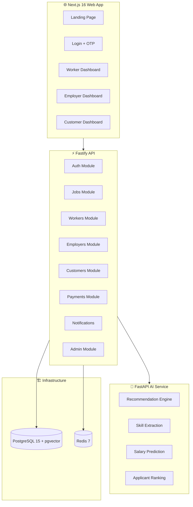

# Hunar AI Platform — Build Walkthrough

## What Was Built

A full-stack, production-ready **AI-powered blue-collar job platform** with 3 applications across a Turborepo monorepo.

---

## Architecture Overview



---

## Phase 1: Infrastructure ✅

| Component | Details |
|-----------|---------|
| **Monorepo** | Turborepo + npm workspaces |
| **Database** | PostgreSQL 15 with pgvector |
| **Cache** | Redis 7 |
| **Schema** | 15 Prisma models with full relations |
| **Shared** | `@hunar/shared` — types, enums, Zod schemas |

---

## Phase 2: Backend API ✅

8 fully implemented API modules:

| Module | Endpoints | Key Features |
|--------|-----------|--------------|
| **Auth** | `/auth/*` | OTP (SHA-256), JWT RS256, refresh rotation |
| **Workers** | `/workers/*` | Profile CRUD, skill taxonomy, AI proxy |
| **Jobs** | `/jobs/*` | Search, apply, AI-ranked applicants |
| **Employers** | `/employers/*` | Job CRUD, worker directory, analytics |
| **Customers** | `/customers/*` | Service requests, bookings, OTP completion |
| **Payments** | `/payments/*` | Razorpay integration, escrow, webhooks |
| **Notifications** | `/notifications/*` | Push inbox, mark read |
| **Admin** | `/admin/*` | User mgmt, disputes, analytics, CSV export |

---

## Phase 3: AI/ML Service ✅

| Engine | Algorithm | Output |
|--------|-----------|--------|
| **Job Recommendations** | TF-IDF + Cosine Similarity + Haversine | Top-N jobs with match % |
| **Skill Extraction** | LangDetect → Translation → Fuzzy Match (80%) | Skills with confidence scores |
| **Salary Prediction** | XGBoost-ready (rule-based MVP) | `{min, median, max}` in INR |
| **Applicant Ranking** | Skill cosine + experience bonus + rating | Ranked applicant list |

---

## Phase 4: Frontend ✅

### Landing Page
````carousel

<!-- slide -->

````

### Login


### Worker Dashboard


### Employer Dashboard


### Customer Dashboard


---

## How to Run Locally

### 1. Start Infrastructure
```bash
docker compose -f infra/docker-compose.yml up -d
```

### 2. Setup Backend API
```bash
cd apps/api
cp ../../.env.example .env
npx prisma migrate dev --name init
npx ts-node prisma/seed.ts
npm run dev
```

### 3. Start AI Service
```bash
cd apps/ai-service
pip install -r requirements.txt
python -m app.main
```

### 4. Start Frontend
```bash
cd apps/web
npm run dev
```

### Test Accounts
| Role | Phone | Name |
|------|-------|------|
| Admin | 9999999999 | Admin User |
| Worker | 9876543210 | Ramesh Kumar |
| Employer | 9876543211 | Priya Sharma |
| Customer | 9876543212 | Aisha Patel |

> [!TIP]
> In dev mode, any 6-digit OTP will work. The dev OTP is also displayed on the verification page.

---

## Remaining Work

| Item | Priority |
|------|----------|
| Job search/browse page | High |
| Employer post-job form | High |
| Customer booking flow | High |
| Voice skill input (Web Speech API) | Medium |
| Worker profile edit page | Medium |
| Real-time notifications (WebSocket) | Medium |
| File upload (avatar, docs) | Medium |
| Integration tests | Medium |
| Docker production builds | Low |
| CI/CD pipeline | Low |
